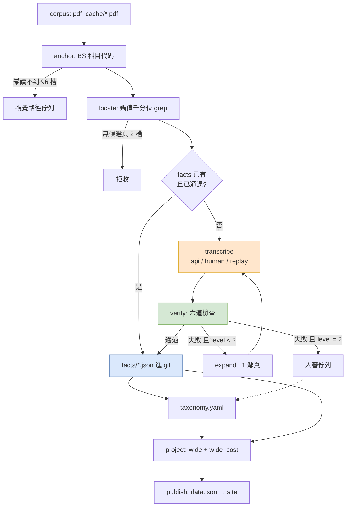
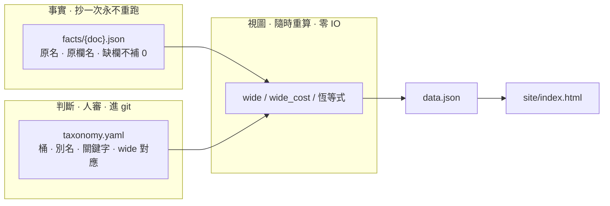

# 架構審查 — 2026-07-27

> 立場:資深架構師,不是除錯者。先無視現有實作、從問題本身推出理想架構,再回頭比對。
> 審查範圍:`v3-locate-transcribe` 分支全部 v3 模組 + 線上舊管線 + `docs/plan_v3_2_flow.md`。
> 所有數字為當日實測(六支測試全綠、資料檔逐筆統計)。

---

## 0. 一句話

**架構的骨頭是對的,缺一根肌肉,而且屍體沒埋。**

- 對的骨頭:錨值定位、算術驅動擴張、事實/判斷/視圖三層分離、三值檢查、拒收不猜。
  這幾件是最貴、最難、多數專案永久做錯的部分。
- 缺的肌肉:**S4 抄列沒有實作**,由互動式 agent session 人工填。→ 19/169 格。
- 沒埋的屍體:`extract_v2` 仍在餵線上網站,`bridge_v3 --write` 一次都沒跑過。

**這兩件是同一件事。** 因為 S4 沒實作 → 覆蓋率上不去 → v3 不敢切換 → 舊管線繼續服役
→ `config.py` 得養 `LEGACY_*` 相容層 → 兩套桶名不准同步。這是一個閉環,不打斷它,
其餘所有改善都不會出現在網站上。

---

## 1. 問題定義(先不看實作)

> 給定 89 份台灣銀行財報 PDF,產出「每家 × 每期 × 每個會計分類 × 7 桶 × 2 口徑」的
> 持債分解,發布到靜態網站。**任何一個發布出去的數字,都必須有算術證明它對得上資產負債表;
> 證不了的一律是 null,不准猜。**

推論一:輸出總量是 `267 槽 × 7 桶 × 2 口徑 ≈ 3,738 個數字`,**這是全部,永遠**。
成長率是每半年約 15 槽。

推論二:所以**這不是一個抽取問題,是一個「有算術證明的資料輸入問題」**,
而分類法是封閉的(10 個桶,不會長大)。

推論三(最重要):**抄列是可驗證的。** 一份抄錯的 rows 要騙過驗收,得同時做到
葉列相加 == 錨、兩表逐列對得上、每列都分得到桶、逐欄合計也對。
→ **可驗證的步驟,不需要可信任的執行者。** 這個性質決定了整個架構。

---

## 2. 理想架構(從零設計)

八個元件,每個一個職責。純函數的標示為 `pure`。

| # | 元件 | 職責 | 輸入 → 輸出 | 性質 |
|---|---|---|---|---|
| 1 | `corpus` | 不可變輸入 | — → PDF,鍵 `{期}_{代碼}_{表別}` | 唯讀 |
| 2 | `anchor` | 讀 BS 三個數字 | PDF → `{類別: 金額}`, bs_page | `pure` 確定性 |
| 3 | `locate` | 找候選頁 | PDF + 錨 → 頁碼清單 | `pure` 零版型知識 |
| 4 | **`transcribe`** | **頁文字 → 原始列** | text → `Record[]` | **唯一非確定性元件** |
| 5 | `verify` | 信任邊界 | `Record[]` + 錨 → `Verdict` | `pure` |
| 6 | `taxonomy` | 原名 → 桶 | 資料檔,進 git | 資料,非程式 |
| 7 | `project` | 事實 + 判斷 → 數字 | facts + taxonomy → wide | `pure` 毫秒級 |
| 8 | `publish` | 出網站 | wide → data.json → site | IO |

**關鍵設計約束(三條,其餘都可談):**

1. **4 是唯一不確定的元件,必須藏在單一介面後面,可換實作**:`api` / `human` / `replay`。
   誰去讀表是**部署決定**,不是架構決定。
2. **5 是唯一的信任邊界。** 4 產出什麼都無所謂,5 過不了就是拒收。
   → 因此 4 可以重跑、可以跑三次取第一個過的、可以換模型,**不需要新增任何信任**。
3. **6、7 重算是免費的。** 改分類表不准重讀 PDF。(這條你已經做到了)

### 2.1 工作流程



橘色 = 唯一不確定的元件。綠色 = 信任邊界。藍色 = 唯一的持久狀態。

### 2.2 資料流與所有權



**所有權規則:** 事實層只有 `transcribe` 能寫,且只在 `verify` 通過後。
判斷層只有人能寫(git diff 就是審核介面)。視圖層沒有人能寫,它是算出來的。

### 2.3 狀態管理

只有**一份**持久狀態:`facts/`。其餘全部無狀態、可重算、可刪。

| 狀態 | 該在哪 | 生命週期 |
|---|---|---|
| 抄到的列 | `facts/{doc}.json`,進 git,append-only | 永久,除非發現抄錯 |
| 分類表 | `taxonomy.yaml`,進 git | 隨人審演進 |
| 頁文字 / 錨 | 記憶體內 per-doc 快取 | 單次執行 |
| 驗收結果 | 算出來的,可丟 | 單次執行 |
| wide / data.json | 算出來的,可丟 | 單次執行 |
| 人審佇列 | 由 `verify` 失敗算出來,**不是存的** | 算出來的 |

**目前不必要的狀態:** `results/rows.json`(是 `scratchpad/rows_v3.json` 的複本)、
根目錄 8 份 `.bak_*`、`data.json.pre_bridge`。git 已經在做版本控制了。

### 2.4 agent 職責(這是 agent 系統嗎?)

**目前是,而且不該是。** 現在有一個 agent(互動式 Claude Code session)身兼四職:

抄列員 · 分類表維護者 · 檢查閾值調校者 · 保留集切分者。

**這是這份架構最嚴重的職責混淆** —— 而且 `holdout.py` 的 docstring 自己說中了原因:
「讀的人與驗的人同一個時,黃金集會退化成複誦」。切保留集時已經有 16 格被同一個 session
抄過並拿來調過表了,3 格保留集擋不住這個量級的洩漏。

**理想的 agent 分解:只要一個,而且只做一件事。**

```
transcriber(prompt: str) -> Record[] | None
```

- 輸入:候選頁純文字 + 錨值。**無記憶、無狀態、不知道分類表存在。**
- 輸出:原名 + 原欄名 + 金額。抄不出來回 None。
- 不准做:分桶、正規化、判斷口徑、決定要不要擴張。
- 驗收由 `verify` 做,agent **看不到自己的分數**(否則會學會讓分數變綠)。

分類表的維護**不是 agent 的工作**,是 `synonyms.py` + `rules.py` 產生提案 + 人 git diff 核准。
你已經建好這條路了,只是抄列員剛好也是同一個 session。

---

## 3. 對照現有實作

### 3.1 保留(這些是資產,不准動)

| 元件 | 為什麼是對的 |
|---|---|
| `locate.py` 錨值 grep | **零版型知識**。整個 repo 最強的想法。267 槽普查有基準、有 `--check` 閘門 |
| `Located.expand()` 算術驅動 | 「對不上就擴,對上就停」→ 不必分辨三種漏抓。分級 + 拒絕較窄判準的實測記錄完整 |
| 三層分離 | 改分類表不重讀 PDF。這是最貴的架構決定,你做對了 |
| 三值檢查 + `NA_*` 不畫綠燈 | 恆真閘門是這類系統的頭號死因 |
| null-not-zero / 拒收不猜 | `wide.pick()` 回 `(None, 理由)` 而不是勉強湊值 |
| `test_cross.py` / `test_wide.py` 注入錯誤 | **不尋常地好。** 證明閘門會失敗,而不只是會通過 |
| `holdout.py` | 概念對(切的時機、一次性、選格理由),只是切太小太晚 |
| `bs_anchor.py` 截斷偵測 | OCR 掉逗號 → 寧可回 None 也不回錯值。這個判斷是對的 |

### 3.2 該重新設計

見 §4 逐項。

### 3.3 該刪除

| 刪什麼 | 行數 | 為什麼 |
|---|---|---|
| `extract_v2.py` | 786 | LLM 一次做完讀值+分桶+對帳,無算術證明。v3 的存在理由就是取代它 |
| `batch_v2.py` / `bridge_v2.py` / `test_oracle.py` | ~450 | 綁死舊格式 |
| `config.py` L63–80 `LEGACY_*` + assert | 18 | 相容層。舊管線一死就沒有存在意義 |
| `config.py` `MODEL`/`MIN_GAP`/`TOL`/`TOL_REL`/`MAX_EXPAND`/`PANEL_JUMP_REL` | 6 | v3 完全沒用(實測:只有舊管線 import) |
| `.env` + 金鑰輪替(`extract_v2.py:44-108`) | 65 | 換成單一 transcriber 後重寫,不是保留 |
| `archive/` `legacy/` | 11+10 檔 | `plan_v3_2_flow.md §8` 已明文不准退回 |
| 根目錄 `*.bak_*` / `*.pre_*.json` / `data.json.pre_bridge` | 12 檔 ~1.1MB | git 已經在做這件事 |
| `phase0.py` `resolve.py` `fetch_test.py` `make_charts.py` `build_native.py` `app.py` | ~380 | 更早期遺物,無人 import |
| `scratchpad/` 60 檔 | — | 除了 `rows_v3.json`(要升格成 `facts/`) |

**總計約 1,700 行程式 + 60 個檔案該消失。** 對照:v3 核心只有 1,568 行,寫得很密。
比例不是「70% 該重寫」,是「**52% 該刪掉,核心一行不改**」。

---

## 4. 架構異味

### S1 ⚠️ 抄列是管線上的一個洞,由人工 session 填補

**症狀**
- 19/169 格(7%)。34 份 record 裡 30 份來自同一期(2024 年報)。
- `pipeline.drive(doc, cls, transcriber)` 介面已經存在,但**沒有任何生產實作**。
- `pipeline.py` docstring:「本檔不呼叫任何模型」「故意留成洞」。

**根本原因 —— 一個推論跳步**

`plan_v3_2_flow.md §0` 的推理鏈是:結構解析器 61/123 → 使用者否決打版
→「Python 只負責找頁與驗收,讀表全交給 agent」。

前兩步完全正確。第三步把**兩個獨立的決定合併了**:

| 決定 | 選項 | 正確答案 |
|---|---|---|
| (a) **誰**讀表 | 死規則 vs 語言模型 | 語言模型 ✅ |
| (b) **怎麼**呼叫 | in-process API vs 互動式 session | **被 (a) 的失敗連坐決定了** |

(b) 之所以選了 session,真正的原因是 `extract_v2` 用 `gemini-3.5-flash-lite` 的失敗經驗。
但**那次失敗的形狀不是「模型讀不懂表」**,是:模型被要求一次做完讀值 + 分桶 + 對帳,
而輸出**沒有算術證明就被收下**。

**v3 已經把那個成因整個拆掉了。** 現在模型只吐原名 + 金額,`verify()` 用算術證它。
→ **那道驗收正是「可以自動呼叫」的授權來源。架構已經付了自動化的代價,卻拒絕收取它的好處。**

**為什麼架構本身在製造這個問題**

因為 `transcribe.py` 的職責被定義成「產生 prompt + 驗收 rows」,中間那步就只能是外部的人。
把 `transcriber` 定義成一個**參數**(而 `drive()` 已經這樣寫了)之後,人與 API 就是同一條路徑上的兩種實作。

**根本重設計**

```python
# transcriber/api.py — 約 40 行
def transcribe(prompt: str, n: int = 3) -> Record | None:
    """跑 n 次取第一個過 verify 的。verify 不通過就是沒抄到。"""
```

驗收邏輯**一行都不改**。錯的抄列會被 `verify()` 擋掉 → `expand()` → 再擋掉 → 進人審佇列。
**沒有延伸任何新的信任。**

**收益**
- 覆蓋率 19 → 169 格是一次無人值守的執行,不是幾週的人工。
- 抄列變成可重跑的 → 發現抄錯不再是災難。
- 打斷 §0 那個閉環:有覆蓋率才敢切換,切換了才能刪舊管線。
- **消除 §2.4 的職責混淆** —— 抄列員不再是那個調表的人,保留集才真的是保留集。

**遷移**
1. 先做 `replay` 實作(讀現有 19 格 rows)當回歸基準 —— 證明介面沒改變行為。
2. 再做 `api` 實作,只跑**已經人工抄過的 19 格**,比對逐列相同 → 這是它的驗收。
3. 通過後才跑其餘 150 格。

**⚠️ 一個誠實的但書:** 我沒有實測過任何模型在這 19 格上的逐列命中率。
上面主張的是「架構不該禁止自動呼叫」,不是「自動呼叫一定會成功」。
第 2 步就是為了先量再下結論 —— 若命中率太低,結論會變成「維持人工但把介面補上」,
而那個結論**也需要先量到才能下**。

---

### S2 `transcribe.py` 是 god module(398 行,六個職責)

**症狀**
- 同時擁有:prompt 組裝 · 六道檢查 · 兩表對帳 · 欄位對齊 · 合併列偵測 · 桶層降級。
- `wide.py:85` 從**驗收層**import `coarse()` 來做**取值來源選擇** —— 視圖層依賴驗收層的內部工具。
- `synonyms.py:55` 借用 `transcribe.align()` —— 同義詞產生器依賴驗收層。
- `verify()`(L353-361)用手寫 f-string 當 key 組 dict,加一道檢查要改三個地方。

**根本原因**
「驗收」這個名字太大,把所有「比較兩份 record」的東西都吸進去了。
但 `align` / `_amounts` / `_merged` / `_by_bucket` / `coarse` 是**對帳原語**,
`check_*` 是**閘門**。原語會被視圖層與同義詞層重用,閘門不會 —— 兩者生命週期不同。

**根本重設計**

```
prompt.py    context_pages()                        ← agent 輸入
recon.py     align / amounts / merged / by_bucket / coarse   ← 純比較原語,無閘門語意
checks.py    CHECKS = [(編號, 名稱, fn, 適用條件), ...]      ← 註冊表,verify 只是迴圈
```

`wide.py` 改 import `recon.coarse`,語意正確:視圖層用對帳原語挑來源,不是「跟驗收借東西」。

**收益** 加一道檢查 = 在 `CHECKS` 加一行。`recon` 可獨立測。`wide` 不再依賴驗收層。

**遷移** 純機械搬移,六支測試就是回歸。半天。

---

### S3 分類法被編碼三次,三種格式

**症狀**

| 表示 | 位置 | 對誰負責 | 怎麼保持同步 |
|---|---|---|---|
| 散文規則 | `config.BUCKET_RULES` | 權威 | — |
| 關鍵字表 | `rules.KEYS` | 提案 | `rules.audit()` + `test_rules.py` |
| 精確別名表 | `buckets.SYN`(80 條) | 生效 | 人 git diff |

再加上散落的 `GROUP_SYN` / `GENERIC` / `PREFIX_ONLY` / `COST_COLS` / `BOOK_COLS` / `BUCKET_MAP`
跨 `config.py` 與 `buckets.py` 兩個檔。

**根本原因**
`BUCKET_RULES` 原本是**寫給 LLM 的 prompt**(舊管線用),後來被追認為人類可讀的規格。
**prompt 不是規格。** 它是散文,所以需要 `rules.py` 把它編成表,所以需要 `audit()` 檢查
編的時候有沒有夾帶私貨 —— 整條鏈都是「權威來源選錯格式」的下游後果。

**根本重設計** 一份機器可讀的 `taxonomy.yaml`:

```yaml
公債:
  wide: GB
  kind: asset
  aliases: [政府公債, 政府債券, 國外機構發行債券]   # 精確比對,生效
  keywords: [政府公債, 公債]                        # 只產生提案,不生效
  note: 國外機構發行債券 → 見 2026-07-26 人審決定
衍生:
  wide: null        # 刻意不進 7 桶
  kind: derivative
```

散文 prompt 若還需要,**從這份表生成**,不是反過來。
→ `rules.audit()` 消失(不再有兩份表示要對)、`LEGACY_*` assert 消失、
`config.py` 的分類法段落消失。

**收益** 「這個名字為什麼歸這桶」變成一個檔一個地方。`buckets.py` 只剩查表邏輯(約 40 行)。

**遷移** 產表 → 讓 `buckets.py` 讀 yaml → `test_synonyms`/`test_rules` 全綠 → 刪三處舊表示。

---

### S4 事實層邊界沒有 schema

**症狀**(實測 19 格 / 34 record / 296 列)
- `printed_totals` 只有 12/34 份有 → 第 6 道檢查對 2/3 的 record 是 N/A。
- `group` 只有 110/296 列有 → `buckets.bucket()` 靠 `.get("group")` 容錯。
- `basis` 欄位已停用(`buckets.basis_of` docstring),但資料裡還在。
- `check_identity` 遇到缺 `total_col` 會 KeyError,不是回檢查失敗。
- `results.main()` 直接 `json.load` 就往下送,零驗證。

**根本原因**
事實層是**人手寫的 JSON**,也就是整個系統唯一的不受信任輸入 ——
而它進入受信任程式碼的那一點,沒有契約。

**根本重設計** `Row` / `Record` dataclass + 邊界 `parse()`,`schema_version` 欄位。
「缺欄」與「值為 0」在型別上分開(`cols: dict[str, int]`,缺就是缺)。
`printed_totals` 缺不缺是**資料事實**,不是可選欄位 —— 明確表示成 `None`。

**收益** 抄列錯誤在邊界就報,而不是深入到第三層才 KeyError。
改成 API 抄列(S1)之後這件事從「好習慣」變成**必要條件**。

---

### S5 兩份事實庫,權威那份在 `scratchpad/`

**症狀** 實測 `results/rows.json` == `scratchpad/rows_v3.json` 濾掉保留集後**完全相同**
(`results.build()` 把 `cells` 原封不動當 `rows` 回傳,`results.py:61`)。
權威事實庫在一個 scratch 目錄裡,而 scratch 目錄的定義就是可以隨時刪。

**根本原因** 事實層被當成「某次執行的中間產物」,而不是**系統最重要的資產**。

**根本重設計** `facts/{doc}.json` 進 git,一份文件一個檔(不是一個大檔 —— 一個大檔的
git diff 在 169 格之後沒人看得動)。`results/` 只放衍生物,`.gitignore` 掉。

**收益** 抄列成果有版本、可 review、可 blame。這是 169 格 × 每格花費之後**最貴的資產**。

---

### S6 ⚠️ 線上服務的是已知有錯的那條管線

**症狀**
- `data.json` ← `bridge_v2` ← `extract_v2`(LLM 直接吐桶,認不得丟「其他」)。
- `bridge_v3 --write` **一次都沒跑過**;`更新網站.command` 仍呼叫 `bridge_v2`。
- 已知差異:玉山「國外機構發行債券」線上歸「其他」,v3 判「公債」,
  單格量級 368 億(2024 OCI 公債 419.7 → 787.7 億)。
- `config.py:63-80` 得養 `LEGACY_BUCKETS` / `LEGACY_BUCKET_RULES` + 一個 assert,
  只為了讓死掉的管線的 prompt 不要跟著 v3 演進。

**根本原因** **這是 S1 的下游。** 7% 覆蓋率不可能切換,而覆蓋率上不去是因為 S1。
切換條件從來沒被寫成一個明確的門檻,所以它永遠「還沒到」。

**根本重設計** 把切換條件寫死成可執行的判準,例如:

```
2023+ 的 169 槽 ≥ 95% 通過,且保留集(重切 15 格)零迴歸 → 切換
```

達標即 `--write`,同日刪 `extract_v2` / `bridge_v2` / `LEGACY_*`。
**不准並存超過一個階段** —— 兩套管線並存的每一天都在製造相容層。

---

### S7 沒有 document 層物件,per-cell 重複解析

`results.build()` 逐格呼叫 `locate.locate()`(`results.py:37`)→ 一份三分類的 PDF
被完整解析三次。`pipeline.run()` 與 `prompt_at()` 各自再解析一次。無快取。

89 份時無感,但這是**缺少 `Document` 這個一等公民**的症狀:錨、頁文字、候選頁
天然屬於文件,現在被迫掛在「格」上重算。修法:`@lru_cache` 只是止痛;
正解是 `Document` 物件持有 `anchors` / `texts`,`Cell` 引用它。

---

### S8 用 `id()` 當 record 的鍵

`transcribe.align()` 回傳 `{id(rec): 欄名}`(L179-192),`synonyms.py:61-64` 也用。
record 有天然主鍵 `(doc, class, source_page)` 卻不用。兩個 alias 到同一物件時
dict 會靜默塌陷。**這是 S4(沒有型別)的直接後果** —— 有了 dataclass 就有 `__hash__`。

---

### S9 `config.py` 混了四種生命週期

品牌色(表現層)· 銀行代碼(資料鍵)· 會計分類法(判斷層)· 模型與節流(已死的基礎設施)
· 舊管線相容層。**改一個顏色跟改一個桶的定義,動的是同一個檔。**

拆成:`taxonomy.yaml`(S3)· `theme.py`(色與顯示名)· `corpus.py`(銀行代碼、表別白名單)。
API 設定隨舊管線一起刪。

---

### S10 用備份檔當版本控制

根目錄 8 份 `extract_v2_results.json.bak_*` + 4 份 `.pre_*` + `data.json.pre_bridge`
+ `golden.yaml.filled-*.bak`,約 1.1MB。而 `bridge_v3.py:102` 還會再寫一份 `.pre_bridge_v3`。

**這是在 git repo 裡。** 根本重設計:寫檔前 `git stash` 或直接依賴 commit,刪除所有 `.bak`。
`bridge_v3` 的備份邏輯改成「未 commit 就拒絕寫」。

---

## 5. 失效分析

| 風險 | 嚴重度 | 現況 | 說明 |
|---|---|---|---|
| **抄列瓶頸** | 🔴 高 | 未處理 | 7% 覆蓋率,且唯一的「執行者」是互動式 session |
| **同一個 agent 抄列又調表** | 🔴 高 | 部分 | 3 格保留集 vs 16 格已污染。分母不對 |
| **線上服務錯誤數字** | 🟠 中高 | 已知未修 | 玉山單格 368 億差異,已知超過一個月 |
| **`SYN` 塞錯無人抓得到** | 🟠 中 | 有機制 | `buckets.py` docstring 自己說了。靠 `rules.propose()` + git diff,是對的做法,但**依賴人每次都照做** |
| 96 槽錨讀不到 | 🟡 低 | 已知已記錄 | 全 ≤2022,現役範圍乾淨。決策已列在 §9 未決 |
| 分欄剝離 | 🟢 極低 | 已結案 | 2/169,證據完整,不要再碰 |

**沒有 race condition / 同步問題** —— 整條管線是單執行緒批次,這是對的選擇。
改成 API 抄列後會出現「跨格平行」的機會,但格與格之間完全獨立,平行是安全的
(唯一共享狀態 `facts/` 是 per-doc 檔案)。

**最脆弱的環節不是程式,是流程:** 分類表的正確性依賴「人每次都跑 `synonyms.py`、
每次都看 git diff、每次都不手工塞」。這在 19 格時做得到,在 169 格時做不到。
→ 應該加一道 CI:`SYN` 的每一條都必須能被 `rules.propose()` 或
`synonyms.candidates()` 或**明確標記的人審決定**其中之一背書,否則 exit 1。
(目前 `test_rules.py` 只驗 `rules.KEYS ⊆ BUCKET_RULES`,沒驗 `SYN` 的來源正當性。)

---

## 6. 總評

### 架構分數:**6.5 / 10**

拆解:

| 面向 | 分 | 說明 |
|---|---|---|
| 核心洞見(定位、算術驅動、三層分離) | 9 | 難的部分做對了,而且有實測支撐,不是拍腦袋 |
| 正確性紀律(三值、null、拒收、注入測試) | 9 | 高於業界平均。`test_cross`/`test_wide` 尤其好 |
| 模組邊界 | 5 | god module + 視圖層依賴驗收層 + 分類法三份 |
| 完整性 | 3 | **缺一個元件**,7% 覆蓋率 |
| 交付 | 2 | 線上是舊管線,已知有錯,相容層在長 |
| 型別與資料契約 | 4 | 事實層無 schema,`id()` 當鍵 |
| 資產管理 | 4 | 權威事實庫在 scratchpad,12 份備份檔 |

**為什麼不是更低:** 一般專案的失敗在「核心想法錯了,但東西會動」——那種要重寫。
這裡是**核心想法對了,但東西還不會動**。後者便宜得多。

**為什麼不是更高:** 一個 7% 覆蓋率、線上跑著舊版本的系統,架構再漂亮也還沒證明自己。
`plan_v3_2_flow.md` 本身寫得比多數團隊的設計文件好,但它也記錄了 R2b(擴大樣本)
被跳過的事實 —— 而那正是現在的瓶頸。

### 最大的弱點(依序)

1. **抄列元件不存在,由人工 session 代打** → 7% 覆蓋率,且污染保留集。
2. **舊管線未除役** → 線上是錯的數字,而且在長相容層。(1 的下游)
3. **`transcribe.py` 是 god module**,視圖層與同義詞層都得跟它借東西。
4. **分類法編碼三次**,靠一支 audit + 一個人工儀式維持一致。
5. **事實層無 schema 且住在 scratchpad**。

### 最大的複雜度來源

不是程式碼 —— v3 核心只有 1,568 行,密度很高、註解品質罕見地好。複雜度來自:

1. **兩套管線並存**(+1,236 行 + 相容層 + 一個 assert + 兩套桶名)。
2. **同一個概念三種表示**(散文 / 關鍵字 / 別名表),外加同步機制。
3. **註解在補架構的洞**。`transcribe.py` 有大量「⚠️ 不准退回舊寫法」的段落 ——
   那些知識是真的,而且寫得極好,但**知識寫在註解裡代表架構沒有把它變成不可能犯的錯**。
   例如「不准手工往 SYN 加名字」是一段 docstring 警告,它應該是一個 CI 閘門(見 §5)。

### 重寫分類:**Moderate Refactor**(中度重構)

**不是** Architectural Rewrite,**不是** Major Refactor。理由:

- 該刪的 ~1,700 行**全部是舊管線與遺物**,不是 v3 的。刪除是零風險動作。
- v3 核心 1,568 行裡,`locate` / `bs_anchor` / `buckets` / `wide` / `holdout` / `pipeline`
  **一行都不用改**。要動的是 `transcribe.py` 的拆分(機械搬移)與分類法的格式(資料遷移)。
- **真正的新工作只有一個元件**:`transcriber` 的 API 實作,約 40 行 + 它的驗收。

「70% 該重寫」在這裡是錯的答案。正確的答案是「**52% 該刪掉,3% 該新增,核心不動**」。

---

## 7. 遷移計畫(依安全順序)

每一步結束都能獨立驗證、可回滾 —— 沿用 `plan_refactor_v3.md §0.1 第 6 條`。

| # | 動作 | 驗收 | 可回滾 |
|---|---|---|---|
| **M0** | `scratchpad/rows_v3.json` → `facts/*.json` 進 git;刪 12 份 `.bak` | 六支測試全綠;`results.py` 讀新路徑輸出逐位元組相同 | git |
| **M1** | 加 `Row`/`Record` dataclass + 邊界 `parse()`(S4) | 19 格全部 parse 通過;注入缺欄測試會失敗 | 純新增 |
| **M2** | `transcriber` 介面 + `replay` 實作(S1 第 1 步) | `drive()` 走 replay 重現 19 格逐列相同 | 純新增 |
| **M3** | **`api` 實作,只跑那 19 格,比對逐列**(S1 第 2 步) | 逐列命中率實測 —— **這是整個計畫的決策點** | 純新增 |
| **M4** | 依 M3 結果:命中率足夠 → 跑滿 169 格;不足 → 改善 prompt 或維持人工但保留介面 | 覆蓋率數字;人審佇列清單 | facts 進 git,可 revert |
| **M5** | 重切保留集(15 格,M4 之前切) | 保留集通過率 vs 訓練集,差距 < 10% | — |
| **M6** | 拆 `transcribe.py` → `prompt`/`recon`/`checks`(S2) | 六支測試全綠,零行為改變 | git |
| **M7** | `taxonomy.yaml` 統一分類法(S3) | `test_synonyms`/`test_rules` 全綠;`SYN` 逐條可追溯 | git |
| **M8** | 加「`SYN` 每條都要有背書」的 CI 閘門(§5) | 注入一條手寫別名 → exit 1 | 純新增 |
| **M9** | **`bridge_v3 --write` 切換**;同日刪 `extract_v2`/`bridge_v2`/`LEGACY_*` | 網站數字 diff 逐格人工確認一次 | `data.json` git 歷史 |
| **M10** | 刪遺物(`archive/` `legacy/` `phase0` `resolve` …)+ `config.py` 拆分(S9) | `python3 -c "import results, wide, synonyms"` 通過;六支測試全綠 | git |

**關鍵路徑是 M2 → M3。** M3 是唯一有未知數的一步,而它的成本是半天。
在跑完 M3 之前,不要對「該不該自動抄列」下任何結論 —— 包括我上面寫的。

**M6–M8 可以與 M4 平行**(不同檔案,零衝突)。
**M9 不准早於 M4** —— 覆蓋率不足就切換,等於把 169 格裡的 150 格變成 null 上線。

---

## 8. 明確不要做

- ❌ 重寫 `locate.py` / `bs_anchor.py` / `expand()`。它們有實測基準,而且是對的。
- ❌ 上資料庫。169 格 × 每格 ~15 列,git diff 就是審核介面。(`plan_v3_2_flow.md §8` 已定)
- ❌ 為了提高通過率放寬任何檢查。六道檢查的嚴格度是這個系統唯一的資產。
- ❌ 在 `verify` 之外新增「接受分支」。拒收是正確輸出。
- ❌ 把 S2 的拆分做成「順便改行為」。純搬移,六支測試當回歸。
- ❌ 先做 M6–M10 再做 M2–M4。**先解決 7%,其餘都是在裝修一棟沒人住的房子。**
